# OpenAdmin

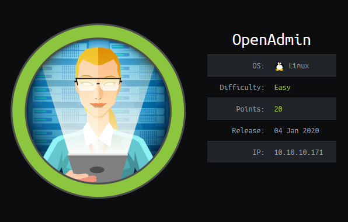

__Task__: Find [user.txt](#user-flag) and [root.txt](#root-flag)

### Penetration Methodologies

__Scanning__

- nmap

__Enumeration__

- dirbuster

__Exploitation__

- Known CVE (ona)

__Priv Esc__

- Port Forwarding

- GTFOBins

***

This write-up is an attempt to show my process of achieving root in the HackTheBox machine _OpenAdmin_. This was my first “start-to-finish” CTF challenge, and I learned a ton of new techniques and tools as I slowly picked my way through the box. As my first rooted machine, this was challenging, and I’m sure others will find success much faster than myself. Regardless, I wanted to take this opportunity to capture my methods and thought processes as I begin to delve into the CTF realm, while hopefully helping those struggling to find the next step. 

## User Flag

I start by scanning the _OpenAdmin_ machine using nmap. I generally output my scan to a text file for portability and easier access later. 

- __sV__: version and service on the port 

- __A__: the OS version and other things

- __O__: remote OS detection using fingerprinting

- __script=banner__: banner information

```
# Nmap 7.80 scan initiated Sun Mar 29 12:33:17 2020 as: nmap -A -O -sV --script=banner -oN scan171.txt 10.10.10.171
Nmap scan report for 10.10.10.171
Host is up (0.22s latency).
Not shown: 998 closed ports
PORT   STATE SERVICE VERSION
22/tcp open  ssh     OpenSSH 7.6p1 Ubuntu 4ubuntu0.3 (Ubuntu Linux; protocol 2.0)
|_banner: SSH-2.0-OpenSSH_7.6p1 Ubuntu-4ubuntu0.3
80/tcp open  http    Apache httpd 2.4.29 ((Ubuntu))
|_http-server-header: Apache/2.4.29 (Ubuntu)
No exact OS matches for host (If you know what OS is running on it, see https://nmap.org/submit/ ).
TCP/IP fingerprint:
OS:SCAN(V=7.80%E=4%D=3/29%OT=22%CT=1%CU=35893%PV=Y%DS=2%DC=T%G=Y%TM=5E80DC3
OS:B%P=x86_64-pc-linux-gnu)SEQ(SP=FE%GCD=1%ISR=108%TI=Z%CI=Z%II=I%TS=A)OPS(
OS:O1=M54DST11NW7%O2=M54DST11NW7%O3=M54DNNT11NW7%O4=M54DST11NW7%O5=M54DST11
OS:NW7%O6=M54DST11)WIN(W1=7120%W2=7120%W3=7120%W4=7120%W5=7120%W6=7120)ECN(
OS:R=Y%DF=Y%T=40%W=7210%O=M54DNNSNW7%CC=Y%Q=)T1(R=Y%DF=Y%T=40%S=O%A=S+%F=AS
OS:%RD=0%Q=)T2(R=N)T3(R=N)T4(R=Y%DF=Y%T=40%W=0%S=A%A=Z%F=R%O=%RD=0%Q=)T5(R=
OS:Y%DF=Y%T=40%W=0%S=Z%A=S+%F=AR%O=%RD=0%Q=)T6(R=Y%DF=Y%T=40%W=0%S=A%A=Z%F=
OS:R%O=%RD=0%Q=)T7(R=Y%DF=Y%T=40%W=0%S=Z%A=S+%F=AR%O=%RD=0%Q=)U1(R=Y%DF=N%T
OS:=40%IPL=164%UN=0%RIPL=G%RID=G%RIPCK=G%RUCK=G%RUD=G)IE(R=Y%DFI=N%T=40%CD=
OS:S)

Network Distance: 2 hops
Service Info: OS: Linux; CPE: cpe:/o:linux:linux_kernel

TRACEROUTE (using port 3306/tcp)
HOP RTT      ADDRESS
1   58.26 ms 10.10.14.1
2   58.10 ms 10.10.10.171

OS and Service detection performed. Please report any incorrect results at https://nmap.org/submit/ .
# Nmap done at Sun Mar 29 12:34:51 2020 -- 1 IP address (1 host up) scanned in 94.69 seconds
```

Two ports came back open, port 22 (SSH) and port 80 (HTTP). Port 80 indicated to me that this machine is a webserver. Without the information already being available to me on the HackTheBox webpage, I can also infer that this is a Linux machine based on the results. Since I don’t have any usernames or passwords, SSH doesn’t seem like the best route right now, so I’ll focus my attention on the webserver.

```
80/tcp open  http    Apache httpd 2.4.29 ((Ubuntu))
|_http-server-header: Apache/2.4.29 (Ubuntu)
```

I navigate to the IP address in my web browser successfully. The machine is hosting Apache2 and is currently displaying the default page for its home: 

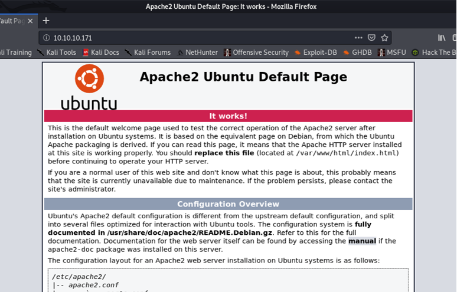

With some research, I found there are a few tools available, one being `DirBuster`, which can brute-force directories. I boot it, adding the target URL, and selecting the directory-list-1.0. The `list info` button can provide good information on which list is appropriate. Once I have my settings, I press start:

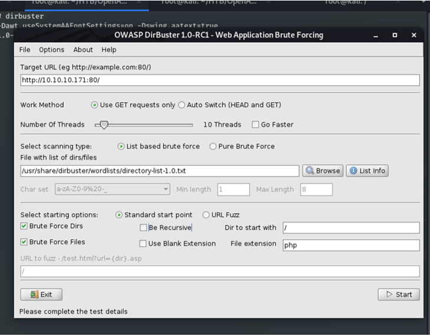

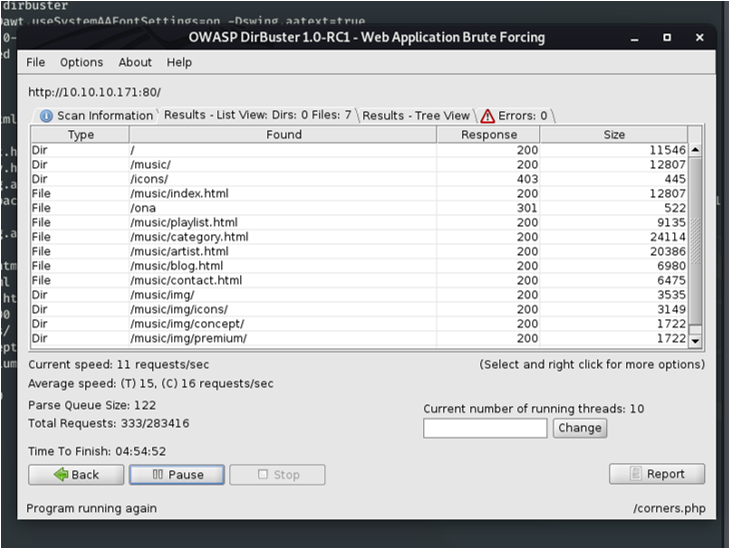

Pretty quickly the results start to come in and I can see that one link is not standard. `/ona` looks promising and received a 200 response, which indicates a successful HTTP request. Ona is the home directory for a project called [OpenNetAdmin](https://github.com/opennetadmin/ona). At this point, I stop `DirBuster` and navigate to `10.10.10.171/ona/` to see what I can find:
 
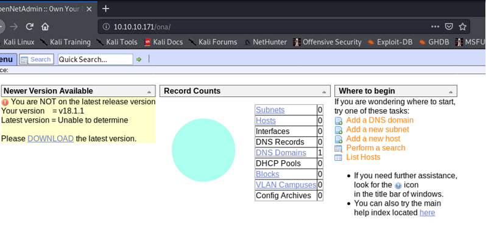
 
Okay, I now have a bit of a peak behind the curtain, and one thing on this page really stands out: I now know their current version number for ona, and it looks like it may be unpatched. At this point, I already have Metasploit running so I search for `opennetadmin 18.1`. My search returns a single exploit, a ping command injection:

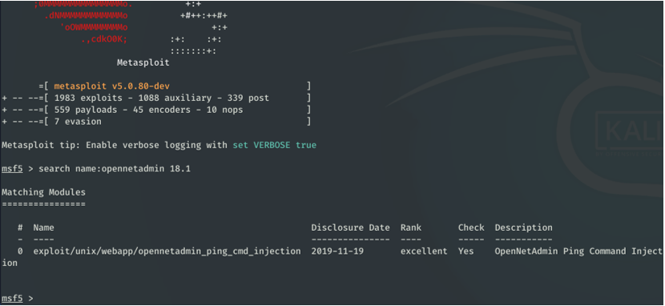
 
My next step is to determine if this exploit will work in this specific scenario, so I run the options command to view a more detailed synopsis. I can see that the version running on the machine falls within the vulnerable versions:

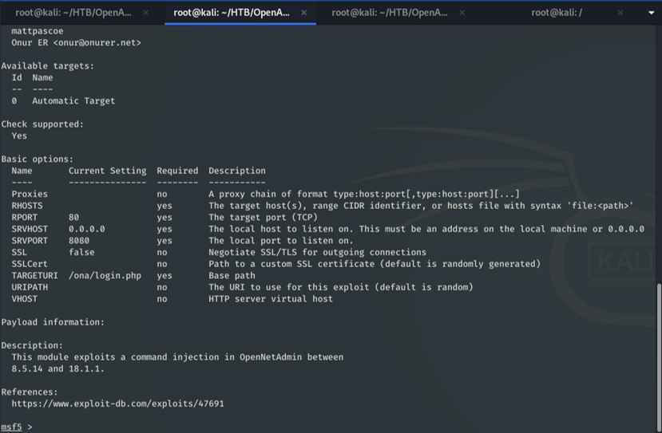
 
Okay, everything looks to be in order, I build out my exploit, setting the target host and selecting the linux meterpreter payload.

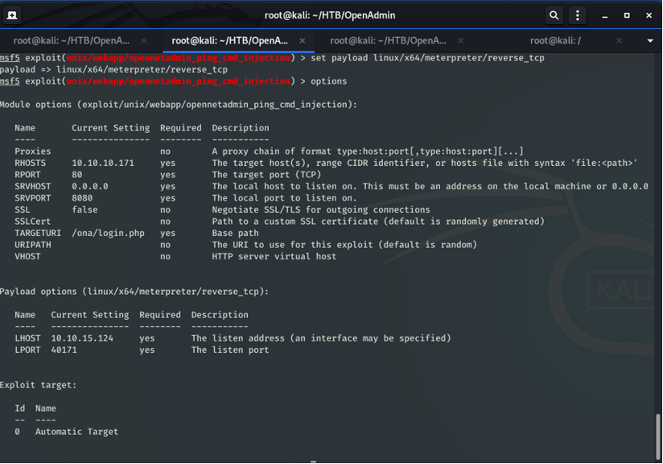
 
I run the exploit and watch as it creates a meterpreter session. Success! I have now gained a foothold within the machine. Now to see if I can find anything of use. Primarily, I know I need to find a way to escalate my privileges. Within the context of these HackTheBox CTFs, that means gaining access to a user account first.

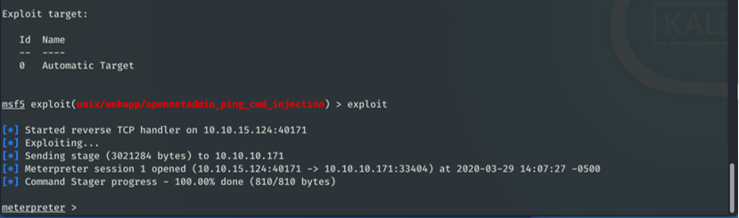
 
For good practice, I run `pwd`, or print working directory, then run `ifconfig`. 

After getting my bearings, I open a shell session from meterpreter. I cat `/etc/passwd`, which reveals a list of users. The two that I make note of are jimmy and joanna.

```
jimmy:x:1000:1000:jimmy:/home/jimmy:/bin/bash
joanna:x:1001:1001:,,,:/home/joanna:/bin/bash
```

I start poking around and find a file named `database_settings.inc.php` within the `/config` folder. When I open it I find a password for the database: `n1nj4W4rri0R!`. 

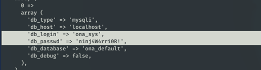
 
I take note of the password. Since many people reuse passwords across services, it’s worth an attempt to see if johnny or joanna have done the same. 
 
From my scan earlier, I noted that port 22, SSH, was also open. I have a couple usernames, and I have a potential password, I decide it’s time to see if I can establish an SSH connection. 
 
I attempt using jimmy first, with success! I have escalated privileges. The first flag on the HackTheBox machines are within the user’s home folder, so I check jimmy’s, with no luck. I need to gain access to the user joanna.

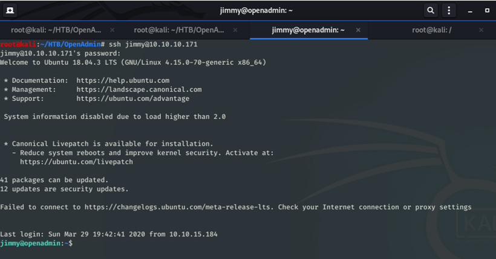
 
Next, I perform a `netstat` and find that the _OpenAdmin_ machine is hosting something on `127.0.0.1:52846`. I’d like to gain access to this service. 

```
tcp	0	0 127.0.0.1:52846	0.0.0.0:*	LISTEN
``` 
  
With some research, I learned that I needed to accomplish remote port forwarding. By utilizing SSH tunneling, I can access the port on _OpenAdmin_ remotely. I learned a lot about this topic from [linuxize](https://linuxize.com/post/how-to-setup-ssh-tunneling/).

```bash
$ ssh -L 52846:localhost:52846 jimmy@10.10.10.171
```

Next, I open my web browser and navigate to `localhost:52846`. I connect successfully, but it looks like jimmy took extra precautions, the page appears to be protected by a login.

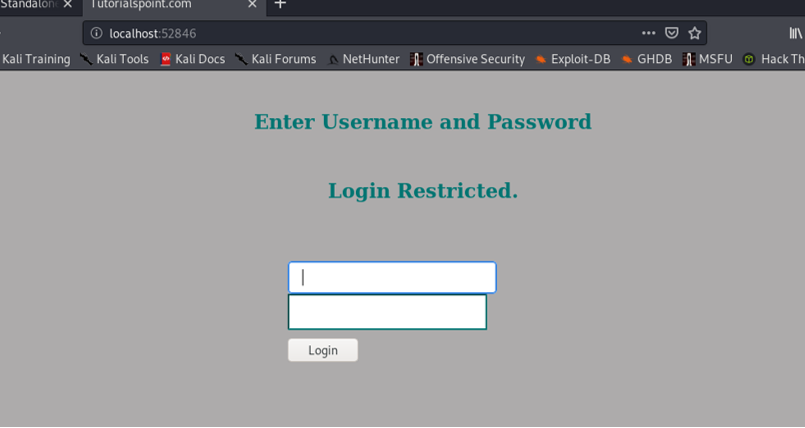

I recall seeing some unrelated webpages when I was poking around on the SSH session as jimmy before. I decide that I wanted to look at this file again to see if it has something that could help me out here. Using the find command, I locate a `index.php` in the `/www/internal` directory and view it. 
 
Within the `index.php` file I find the html `<div>` tag containing the login form. This form has an embedded php script that checks the login and password directly, and I can plainly see the login and the hashed password, which is hashed with with SHA512. 
 
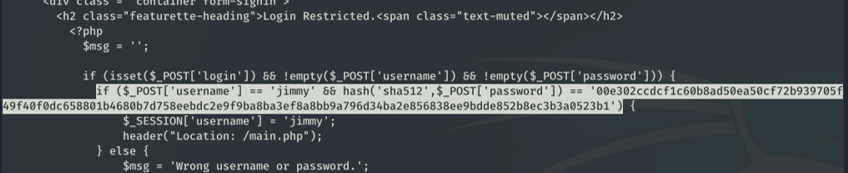
 
I grab the password hash and navigate to a website that can crack SHA512 hashes, hoping that the password isn’t too complex. Fortunately, the password is quickly `Revealed`.

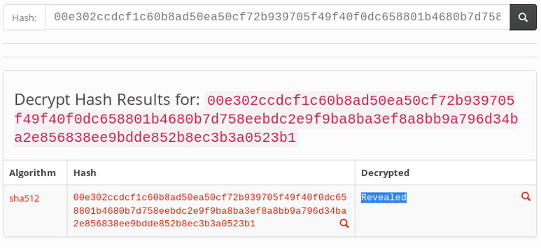
 
I return to the index page and attempt the username, jimmy, and the new password. 
 
I successfully log in, where I find an RSA private key, presumedly belonging to joanna, for whatever reason. I copy the RSA key to a text file.

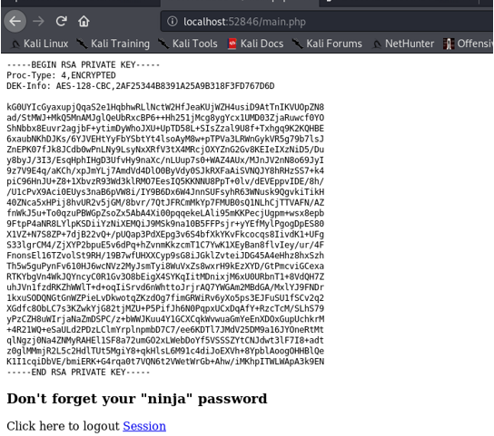
 
I use ssh2john.py to hash the newly attained RSA key and then use john in conjunction with the word list `rockyou.txt` to crack the pass phrase `bloodninjas`.

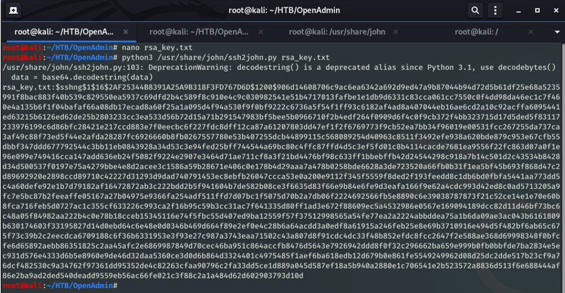

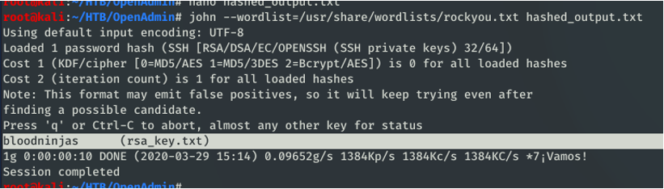
 
Before attempting to SSH, I need to change the permissions on the text file containing the private RSA key. 

```bash
# chmod 600 rsa_key.txt
```

Now, I am ready to attempt to connect to the machine with joanna; I have her username, potentially her key, and her passphrase. I attempt SSH, and success! I am now connected as joanna.

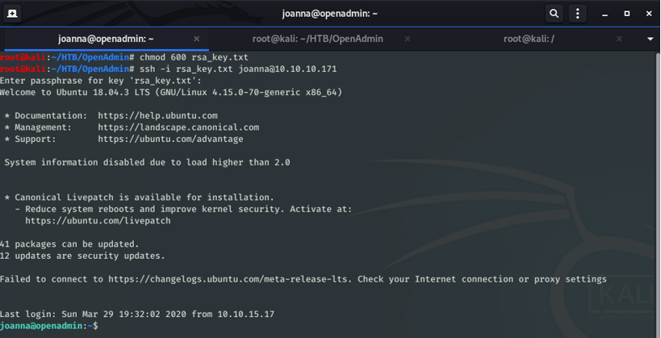
 
I check joanna’s home directory and find the first flag, `user.txt`. Now on to root!
 
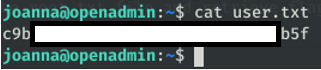

## Root Flag

Now that I am joanna, I run the command `sudo -l`, which lists the user’s allowed commands. In this case, joanna can run the `/bin/nano` command on the `/opt/priv` text file as root, without root’s password. 
 
I run my command with sudo, and find myself within a text file, with potentially escalated privileges.

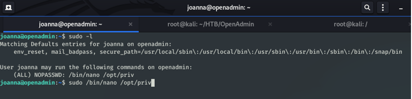
 
Using [GTFOBins](https://gtfobins.github.io/), a “curated list of Unix binaries that can be exploited by an attacker to bypass local security restrictions”, I can spawn a shell with escalated privileges. I decided to attempt the commands from the site within the nano session:

```bash
^R^X
reset; sh 1>&0 2>&0
```

Success! It’s difficult to see, but I successfully spawned a shell session. I can now grab the final flag. I have now completed OpenAdmin!

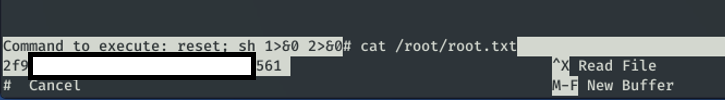 
 
***

Overall, I had a lot of fun with this box and I learned a ton. It was slow going at times, but I feel that I will certainly use the techniques I covered here going forward. The range of tools and concepts required to root this box was certainly beneficial and seeing some of them in action really drove their purpose home.

I am also including my personal rankings of the box, like the criteria on HackTheBox.  I would like to track my growth and I feel these rankings will help capture my mindset and understanding of CTFs and security analysis in general.

### Rankings:

__Real-life Applicable__: 6/10

__Common Vulnerabilities__: 8/10

__Enumeration__: 7/10
